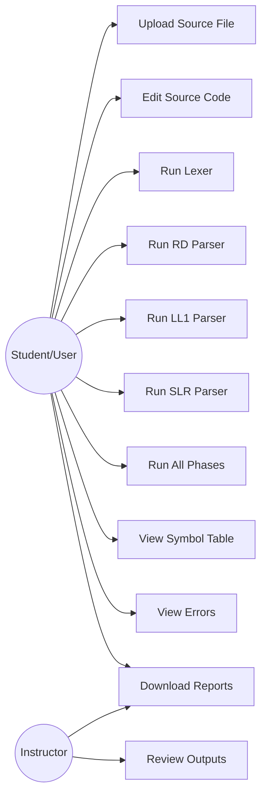
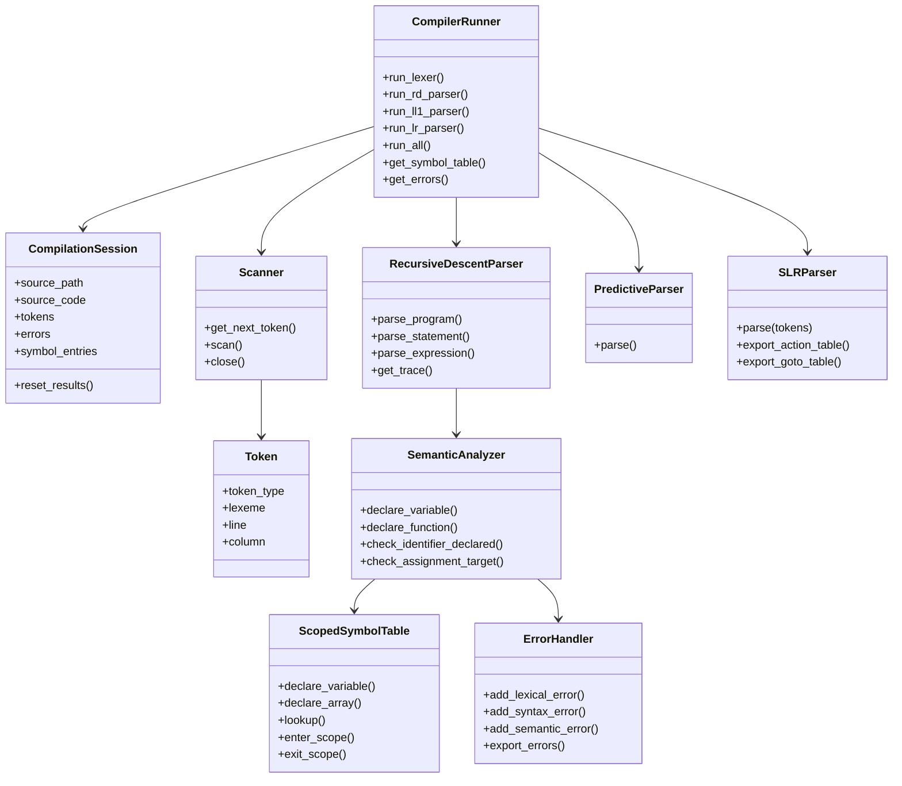
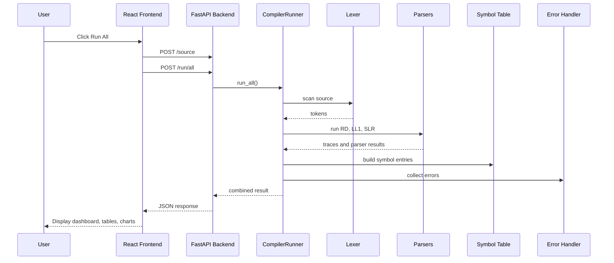
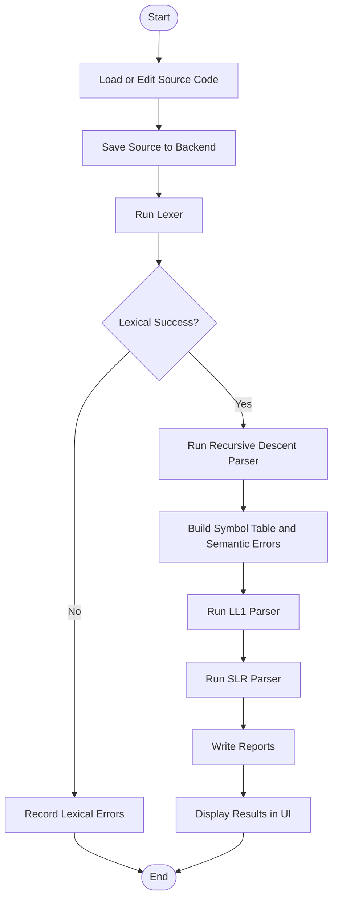

# Mini Pascal Compiler Studio

## Final Year University Project Report

**Project Title:** Mini Pascal Compiler Studio: A Web-Based Compiler Construction and Visualization Platform  
**Course:** Compiler Construction Lab / Final Year Project  
**Submitted By:** [Student Name 1], [Student Name 2], [Student Name 3], [Student Name 4]  
**Registration Numbers:** [Registration Numbers]  
**Submitted To:** [Supervisor Name]  
**Department:** Department of Computer Science / Software Engineering  
**University:** [University Name]  
**Session:** 2025-2026  
**Submission Date:** [Date]

> **Formatting note:** This report is written in a professional university-report style and is suitable for conversion to DOCX/PDF. Replace bracketed placeholders with institution-specific information, add page numbers, and insert screenshots/diagrams at the marked positions before final submission.

---

# Certificate

This is to certify that the project titled **"Mini Pascal Compiler Studio: A Web-Based Compiler Construction and Visualization Platform"** has been completed by **[Student Names]** under the supervision of **[Supervisor Name]**. The work presented in this report is original to the best of our knowledge and has been carried out as part of the requirements for the course/project **Compiler Construction Lab / Final Year Project** in the Department of **[Department Name]**, **[University Name]**.

The project demonstrates the design and implementation of a complete educational compiler system for a subset of Pascal. It includes lexical analysis, recursive descent parsing, LL(1) predictive parsing, SLR parsing, symbol table construction, semantic checking, error handling, report generation, and a modern web-based user interface.

**Supervisor Signature:** ___________________________  
**Name:** [Supervisor Name]  
**Date:** ___________________________

**Head of Department Signature:** ___________________________  
**Name:** [HOD Name]  
**Date:** ___________________________

---

# Acknowledgement

We express our sincere gratitude to **[Supervisor Name]** for guidance, feedback, encouragement, and technical direction throughout the development of this project. The concepts involved in compiler construction require both theoretical understanding and disciplined implementation, and the supervisor's support helped us translate formal compiler concepts into a working software system.

We also thank the faculty members of the Department of **[Department Name]** for providing the academic foundation required for this project, particularly in the areas of automata theory, formal languages, data structures, software engineering, and web application development.

We acknowledge the influence of standard compiler construction literature, especially the Pascal subset and compiler project guidance described in the Dragon Book. The project was designed as an educational system that makes compiler phases observable, measurable, and easier to understand through visual output.

Finally, we thank our families, classmates, and peers for their motivation and support during the development and documentation of this work.

---

# Abstract

Compiler construction is a core area of computer science that connects formal language theory, automata, parsing algorithms, semantic analysis, data structures, and software engineering. Although compiler theory is often taught through mathematical notation and grammar transformations, students frequently face difficulty understanding how different compiler phases interact in a real implementation. This project, **Mini Pascal Compiler Studio**, addresses that gap by providing a complete web-based compiler construction and visualization platform for a subset of Pascal.

The system implements a Mini Pascal compiler using Python and exposes the compiler phases through a FastAPI backend. The frontend is built with React, Vite, Tailwind CSS, Framer Motion, Recharts, and React Router. The backend includes lexical analysis, recursive descent parsing, LL(1) predictive parsing, SLR parsing, scoped symbol table management, semantic analysis, error handling, and report generation. The frontend provides an integrated source editor, upload functionality, phase-wise execution controls, token tables, parser traces, FIRST and FOLLOW sets, LL(1) parsing tables, SLR ACTION/GOTO tables, symbol tables, error lists, dashboards, charts, and downloadable reports.

The compiler supports major constructs of a Pascal subset, including program declarations, variable declarations, integer and real types, arrays, functions, procedures, compound statements, assignments, conditionals, loops, arithmetic expressions, relational expressions, logical operators, and standard input/output procedures. The implementation is based on classical compiler construction principles such as double buffering, tokenization, grammar transformation, FIRST/FOLLOW computation, table-driven parsing, LR item construction, panic-mode error recovery, and scoped symbol table design.

The final system is both a working compiler front end and an academic learning tool. It allows users to inspect intermediate artifacts produced by compiler phases, compare parsing approaches, observe syntax and semantic errors, and download generated reports. The project demonstrates that compiler construction can be made more accessible by combining formal algorithms with interactive visualization and modular software architecture.

**Keywords:** Compiler Construction, Mini Pascal, Lexical Analysis, Recursive Descent Parser, LL(1), SLR Parser, Symbol Table, Semantic Analysis, FastAPI, React, Compiler Visualization.

---

# Table of Contents

1. Title Page  
2. Certificate  
3. Acknowledgement  
4. Abstract  
5. Table of Contents  
6. List of Figures  
7. List of Tables  
8. Introduction  
9. Literature Review  
10. System Analysis  
11. System Design  
12. Methodology  
13. Implementation  
14. Workflow and Execution  
15. Results and Outputs  
16. Performance Evaluation  
17. Tables  
18. Graphs and Visualizations  
19. Testing  
20. Discussion  
21. Future Enhancements  
22. Conclusion  
23. References  
24. Appendices  

---

# List of Figures

| Figure No. | Title | Page |
|---:|---|---:|
| 1 | Mini Pascal Compiler Studio Home/Dashboard Screenshot | [Page] |
| 2 | System Architecture Diagram | [Page] |
| 3 | Compiler Pipeline Diagram | [Page] |
| 4 | Use Case Diagram | [Page] |
| 5 | Class Diagram | [Page] |
| 6 | Sequence Diagram for Run All Compilation | [Page] |
| 7 | Activity Diagram for Compiler Execution | [Page] |
| 8 | Lexer Output Screenshot | [Page] |
| 9 | Recursive Descent Parser Trace Screenshot | [Page] |
| 10 | LL(1) FIRST/FOLLOW and Parsing Table Screenshot | [Page] |
| 11 | SLR ACTION/GOTO Table Screenshot | [Page] |
| 12 | Symbol Table Screenshot | [Page] |
| 13 | Error Handler Screenshot | [Page] |
| 14 | Reports Page Screenshot | [Page] |
| 15 | Token Distribution Pie Chart | [Page] |
| 16 | Parser Result Bar Chart | [Page] |
| 17 | Execution Time Line Graph | [Page] |
| 18 | Accuracy Comparison Graph | [Page] |

---

# List of Tables

| Table No. | Title | Page |
|---:|---|---:|
| 1 | Comparison of Parser Techniques | [Page] |
| 2 | Comparison with Existing Compiler Tools | [Page] |
| 3 | Functional Requirements | [Page] |
| 4 | Non-Functional Requirements | [Page] |
| 5 | Feasibility Study | [Page] |
| 6 | Module Design Summary | [Page] |
| 7 | API Endpoint Summary | [Page] |
| 8 | Token Categories | [Page] |
| 9 | Symbol Table Fields | [Page] |
| 10 | Error Categories | [Page] |
| 11 | Test Cases | [Page] |
| 12 | Test Results | [Page] |
| 13 | Experimental Result Dataset | [Page] |
| 14 | Performance Metrics | [Page] |
| 15 | Graph Data | [Page] |

---

# 1. Introduction

## 1.1 Background

A compiler is a software system that translates a program written in a source language into another representation, usually a target language, intermediate code, or executable machine code. The construction of compilers is one of the most important topics in computer science because it combines theory and practice. It uses concepts from formal languages, automata theory, graph algorithms, data structures, type systems, programming language design, and software engineering.

Compiler construction is normally divided into phases. The front end of a compiler performs lexical analysis, syntax analysis, semantic analysis, and intermediate representation generation. The back end performs optimization and code generation. In academic compiler construction courses, the focus is often placed on the front-end phases because these phases clearly demonstrate formal grammar processing and language recognition.

Pascal has historically been used in compiler construction education because its syntax is structured and its grammar is suitable for demonstrating lexical analysis, parsing, symbol tables, and semantic analysis. A subset of Pascal is also used in classical compiler literature as an example language for programming assignments.

The **Mini Pascal Compiler Studio** project implements an educational compiler front end for a subset of Pascal and presents the results through a web-based dashboard. Rather than only producing a textual accept/reject result, the system shows tokens, parser traces, FIRST sets, FOLLOW sets, parsing tables, SLR ACTION/GOTO tables, symbol tables, error summaries, and generated reports.

## 1.2 Problem Statement

Compiler construction is difficult for many students because the subject contains a large number of abstract concepts. Students may understand definitions such as FIRST set, FOLLOW set, parsing table, or LR item in theory, but they often struggle to see how these concepts interact during actual compilation.

Traditional compiler assignments are usually command-line based. They may generate tokens or parser results, but they do not always provide a clear visual explanation of the internal process. This creates the following problems:

- Students cannot easily observe intermediate compiler artifacts.
- Different parsing strategies are difficult to compare practically.
- Error handling and semantic checking are often hidden inside source code.
- Generated reports are not centralized.
- User interaction with compiler phases is usually limited.

The project addresses these issues by building a complete web-based compiler studio that executes each compiler phase independently or collectively and presents output in a structured, visual, and downloadable format.

## 1.3 Motivation

The motivation behind the project is to make compiler construction easier to understand through implementation and visualization. A compiler is not only a theoretical model; it is also a software pipeline. By building each phase and exposing its internal output, the project helps students connect formal algorithms with actual program behavior.

The project is also motivated by the need for an educational tool that supports:

- Practical demonstration of lexical analysis.
- Comparison of recursive descent, LL(1), and SLR parsing.
- Visualization of parsing tables and parser traces.
- Explanation of symbol table construction and semantic checking.
- A modern interface for compiler experiments.
- Report generation for academic submission and evaluation.

## 1.4 Objectives

The major objectives of the project are:

1. To design and implement a lexical analyzer for a subset of Pascal.
2. To implement a recursive descent parser for top-down parsing.
3. To implement FIRST and FOLLOW set computation.
4. To generate an LL(1) parsing table and implement a predictive parser.
5. To implement an SLR parser using LR(0) item sets and ACTION/GOTO tables.
6. To create a scoped symbol table for identifiers, functions, procedures, and arrays.
7. To perform semantic checks such as duplicate declaration and undeclared identifier detection.
8. To collect and categorize lexical, syntax, semantic, type, and scope errors.
9. To create a FastAPI backend exposing compiler phases as REST endpoints.
10. To build a React-based frontend dashboard for compiler visualization.
11. To generate downloadable compiler reports.
12. To evaluate the system using test cases and sample performance metrics.

## 1.5 Scope

The scope of this project is the design and implementation of a compiler front end for a Mini Pascal subset. The project includes:

- Source code upload and source editor input.
- Lexical scanning with token generation.
- Recursive descent parsing.
- LL(1) parsing table generation and predictive parsing.
- SLR parser construction and execution.
- Symbol table generation.
- Semantic checks.
- Error reporting.
- Dashboard and visualization.
- Downloadable report files.

The project does not implement full machine code generation, optimization, or execution of Pascal programs. It is mainly focused on compiler front-end analysis.

## 1.6 Limitations

The project has the following limitations:

- It supports a subset of Pascal rather than the complete Pascal language.
- It does not generate target machine code or executable binaries.
- It does not include an intermediate code generator.
- Semantic analysis is limited to basic declaration, scope, call, assignment, array, and type checks.
- The backend stores compilation state in a shared in-memory session, which is suitable for academic demonstration but not ideal for multi-user production use.
- The performance evaluation uses controlled test data and sample metrics; larger benchmark suites should be added for research-level evaluation.
- Screenshots and diagrams must be inserted manually before final printed submission.

---

# 2. Literature Review

## 2.1 Existing Research

Compiler construction has been studied for decades and remains a central topic in computer science. Foundational compiler texts define the standard phases of compilation: lexical analysis, syntax analysis, semantic analysis, intermediate code generation, optimization, and code generation. The Dragon Book by Aho, Lam, Sethi, and Ullman is one of the most widely used references for compiler construction and includes a Pascal subset as a programming project language.

Lexical analysis is traditionally implemented using finite automata. The lexical analyzer reads characters and groups them into tokens such as identifiers, keywords, numbers, operators, and punctuation. Efficient input handling techniques such as buffering and lookahead are used to improve scanning performance.

Syntax analysis is performed using parsing algorithms. Top-down parsing techniques include recursive descent and LL(1) predictive parsing. Bottom-up parsing techniques include LR, SLR, LALR, and canonical LR parsing. Recursive descent parsing is easy to implement and understand, but it requires grammar forms that avoid left recursion. LL(1) parsing uses FIRST and FOLLOW sets to construct a parsing table. SLR parsing uses LR(0) item sets and FOLLOW sets to build ACTION and GOTO tables.

Semantic analysis checks whether the program is meaningful beyond grammar correctness. A program may be syntactically valid but semantically invalid if it uses an undeclared identifier, redeclares a variable in the same scope, or calls a function with the wrong number of arguments. Symbol tables are used to store information about identifiers and their properties.

Modern educational tools increasingly combine compiler implementation with visualization. Visualizing tokens, grammar derivations, parsing stack operations, and symbol table entries helps students understand internal compiler behavior more effectively.

## 2.2 Related Work

Several compiler construction tools and educational systems are related to this project:

- **ANTLR:** A parser generator widely used for language recognition and compiler front ends. It supports grammar-driven parser generation.
- **Yacc/Bison:** Traditional parser generators for LALR parsing.
- **LLVM:** A compiler infrastructure used for industrial compiler development.
- **Online parser visualizers:** Tools that demonstrate grammar parsing, parse trees, or automata construction.
- **Command-line student compilers:** Academic compiler assignments that implement lexical and syntax analysis for small languages.

Mini Pascal Compiler Studio differs from these systems because it is designed specifically as an integrated academic dashboard. It does not aim to replace industrial compiler frameworks; instead, it focuses on showing compiler phases interactively for educational use.

## 2.3 Comparison of Parser Techniques

| Feature | Recursive Descent | LL(1) Predictive Parser | SLR Parser |
|---|---:|---:|---:|
| Parsing Direction | Top-down | Top-down | Bottom-up |
| Implementation Style | Manual functions | Stack and table | Shift-reduce table |
| Grammar Requirement | No left recursion | LL(1) grammar | SLR-compatible grammar |
| Uses FIRST/FOLLOW | Indirectly | Yes | FOLLOW used for reductions |
| Table Required | No | Yes | Yes |
| Trace Type | Function entry/exit | Stack expansion/match | Shift/reduce actions |
| Ease of Understanding | High | Medium | Medium to difficult |
| Error Recovery | Manual | Panic-mode possible | Table/stack recovery |
| Educational Value | Excellent for grammar mapping | Excellent for FIRST/FOLLOW | Excellent for LR theory |

**Explanation:** Table 1 compares the three parsing techniques implemented in the project. Recursive descent is easiest to map to grammar rules, LL(1) clearly shows predictive parsing concepts, and SLR demonstrates bottom-up parsing and table construction.

## 2.4 Comparison with Existing Compiler Tools

| Tool/System | Purpose | Strength | Limitation for This Project |
|---|---|---|---|
| ANTLR | Parser generation | Powerful grammar tooling | Less focus on manual compiler phase learning |
| Bison/Yacc | LALR parser generation | Industry-tested parser generation | Requires separate lexer integration and command-line workflow |
| LLVM | Compiler infrastructure | Industrial code generation and optimization | Too complex for beginner compiler visualization |
| Online parser demos | Visualization | Easy to use | Usually limited to parsing only |
| Mini Pascal Compiler Studio | Academic compiler studio | Integrated phases and web visualization | Limited to Mini Pascal front end |

**Explanation:** Table 2 positions the proposed system as an educational compiler studio rather than a production compiler framework.

---

# 3. System Analysis

## 3.1 Requirements Analysis

The system requirements were identified based on the goals of a compiler construction academic project. The system must allow a user to provide Pascal source code, run compiler phases, observe intermediate results, and download reports.

The main actors are:

- **Student/User:** Uploads or writes source code, runs compiler phases, studies outputs.
- **Instructor/Evaluator:** Reviews correctness, reports, parser traces, and generated artifacts.
- **System:** Performs compiler analysis and returns structured results.

## 3.2 Functional Requirements

| ID | Requirement | Description | Priority |
|---|---|---|---|
| FR-01 | Source Upload | User can upload `.pas` or `.txt` source files. | High |
| FR-02 | Source Editing | User can edit Pascal code in the browser. | High |
| FR-03 | Lexer Execution | System generates tokens from source code. | High |
| FR-04 | Token Statistics | System calculates keyword, identifier, number, and operator counts. | Medium |
| FR-05 | RD Parser | System runs recursive descent parsing and shows trace. | High |
| FR-06 | LL(1) Parser | System computes FIRST/FOLLOW sets, table, and trace. | High |
| FR-07 | SLR Parser | System generates ACTION/GOTO tables and shift-reduce trace. | High |
| FR-08 | Symbol Table | System displays scoped symbol entries. | High |
| FR-09 | Error Handler | System displays categorized errors. | High |
| FR-10 | Run All | System executes all phases in sequence. | High |
| FR-11 | Reports | System generates downloadable text reports. | Medium |
| FR-12 | Dashboard | System displays summary statistics and charts. | Medium |

## 3.3 Non-Functional Requirements

| ID | Requirement | Description |
|---|---|---|
| NFR-01 | Usability | Interface must be understandable for students. |
| NFR-02 | Performance | Compiler phases should execute within acceptable time for classroom examples. |
| NFR-03 | Maintainability | Code should be modular with separate compiler and API layers. |
| NFR-04 | Reliability | System should handle invalid source code without crashing. |
| NFR-05 | Scalability | Architecture should allow additional compiler phases in the future. |
| NFR-06 | Portability | System should run on standard Python and Node.js environments. |
| NFR-07 | Readability | Reports and traces should be readable and downloadable. |
| NFR-08 | Security | File uploads should be restricted to accepted extensions. |

## 3.4 Feasibility Study

| Feasibility Type | Analysis | Result |
|---|---|---|
| Technical Feasibility | Python, FastAPI, React, and Vite are mature tools suitable for building the system. | Feasible |
| Operational Feasibility | The system is easy to operate through a web interface. | Feasible |
| Economic Feasibility | Uses open-source tools and requires no paid infrastructure for local execution. | Feasible |
| Schedule Feasibility | The project can be developed in modules: lexer, parsers, backend, frontend, reports. | Feasible |
| Academic Feasibility | Directly matches compiler construction course objectives. | Feasible |

## 3.5 System Constraints

The system works locally by running a backend server and a frontend development server. The frontend expects the backend API at `http://127.0.0.1:8000` by default. The compiler input is stored through the upload/source API, and outputs are generated in the backend `outputs` directory.

---

# 4. System Design

## 4.1 Overall Architecture

The system follows a client-server architecture. The frontend is a React single-page application. The backend is a FastAPI server that exposes REST endpoints. The compiler modules are implemented in Python and are called by the backend through a runner class.

```mermaid
flowchart LR
    User[User / Student] --> UI[React Frontend]
    UI --> API[FastAPI Backend]
    API --> Runner[Compiler Runner]
    Runner --> Lexer[Lexer]
    Runner --> RD[Recursive Descent Parser]
    Runner --> LL1[LL(1) Parser]
    Runner --> SLR[SLR Parser]
    Runner --> Sem[Semantic Analyzer]
    Runner --> ST[Symbol Table]
    Runner --> EH[Error Handler]
    Runner --> Reports[Output Reports]
```

**Figure 2: System Architecture Diagram**  
This figure shows how the user interacts with the React frontend, which communicates with the FastAPI backend. The backend delegates compilation tasks to the compiler runner and compiler modules.

**Screenshot Placeholder:** Insert architecture diagram image here if Mermaid is not accepted by the university template.

## 4.2 Compiler Pipeline Design

```mermaid
flowchart TD
    A[Source Code] --> B[Lexical Analyzer]
    B --> C[Token Stream]
    C --> D[Recursive Descent Parser]
    C --> E[LL(1) Predictive Parser]
    C --> F[SLR Parser]
    D --> G[Semantic Analyzer]
    G --> H[Symbol Table]
    D --> I[Errors]
    E --> I
    F --> I
    H --> J[Reports]
    I --> J
```

**Figure 3: Compiler Pipeline Diagram**  
The compiler pipeline starts with source code, produces tokens, applies multiple parser strategies, performs semantic analysis, builds the symbol table, and generates reports.

## 4.3 Module Design

| Module | File/Directory | Responsibility |
|---|---|---|
| Backend Main App | `backend/main.py` | FastAPI application setup and router registration |
| API Layer | `backend/api/` | REST endpoints for upload, source, phases, reports |
| Compiler Runner | `backend/compiler/integration/runner.py` | Coordinates compiler phases and session updates |
| Session | `backend/compiler/integration/session.py` | Stores current source and phase outputs |
| Lexer | `backend/compiler/lexer/` | Scans source code into tokens |
| RD Parser | `backend/compiler/parsers/recursive_descent.py` | Performs top-down parsing and semantic integration |
| LL(1) Analyzer | `backend/compiler/parsers/first_follow.py` | Computes grammar FIRST/FOLLOW sets |
| LL(1) Table | `backend/compiler/parsers/parsing_table.py` | Builds predictive parsing table |
| Predictive Parser | `backend/compiler/parsers/predictive_parser.py` | Runs LL(1) stack-driven parser |
| SLR Parser | `backend/compiler/lr_parser/lr_parser.py` | Builds LR item sets and parses using ACTION/GOTO |
| Symbol Table | `backend/compiler/symbol_table/` | Manages scoped identifiers |
| Semantic Analyzer | `backend/compiler/semantic_analyzer.py` | Performs semantic checks |
| Error Handler | `backend/compiler/error_handler/` | Collects and exports errors |
| React Context | `frontend/src/context/CompilerContext.jsx` | Stores frontend application state |
| API Service | `frontend/src/services/api.js` | Axios requests to backend |
| Pages | `frontend/src/pages/` | Dashboard and phase-specific screens |
| Components | `frontend/src/components/` | Tables, editor, sidebar, badges, charts |

## 4.4 Database Design

The project does not use a persistent relational database. Instead, it uses:

- In-memory session state for current compilation data.
- Uploaded source files stored in `backend/uploads/`.
- Generated text reports stored in `backend/outputs/`.

For academic documentation, the following logical data entities can be considered:

| Logical Entity | Fields | Storage |
|---|---|---|
| Source File | filename, source_code, path | Upload directory and session |
| Token | token_type, lexeme, line, column | Session and `tokens.txt` |
| Symbol | name, kind, type, scope, line, column | Session and `symbol_table.txt` |
| Error | type, line, column, message, lexeme, context | Session and `errors.txt` |
| Parser Trace | phase, step, action | Session and trace files |
| Report | filename, label, download link | Output directory |

**Explanation:** Since the project is an educational local compiler studio, a database is not mandatory. However, the logical design can be extended to a database in future work for multi-user support.

## 4.5 UML Use Case Diagram



**Figure 4: Use Case Diagram**  
This diagram shows the main actions available to students and instructors.

## 4.6 UML Class Diagram



**Figure 5: Class Diagram**  
The class diagram shows the major backend classes and their relationships.

## 4.7 Sequence Diagram



**Figure 6: Sequence Diagram for Run All Compilation**  
This sequence shows how the frontend and backend coordinate when the user executes all compiler phases.

## 4.8 Activity Diagram



**Figure 7: Activity Diagram for Compiler Execution**  
This activity diagram summarizes the decision flow followed during full compilation.

---

# 5. Methodology

## 5.1 Development Approach

The project follows a modular development methodology. Each compiler phase was developed separately and later integrated through the backend runner and frontend dashboard.

The development process included:

1. Studying the Mini Pascal grammar.
2. Defining lexical tokens and keywords.
3. Implementing a scanner with input buffering.
4. Implementing recursive descent parsing.
5. Designing the symbol table and semantic checks.
6. Implementing FIRST/FOLLOW computation.
7. Building the LL(1) parsing table.
8. Implementing predictive parsing.
9. Implementing SLR parsing through LR(0) item sets.
10. Creating FastAPI endpoints.
11. Building React pages and reusable components.
12. Testing with valid and invalid Pascal programs.
13. Generating reports and performance tables.

## 5.2 Lexical Analysis Algorithm

The lexer reads the input source file character by character and groups characters into tokens. It recognizes reserved keywords, identifiers, numbers, operators, punctuation, comments, and end-of-file.

### Pseudocode: Lexical Scanner

```text
procedure SCAN(source_file)
    initialize buffer
    tokens = empty list

    repeat
        skip whitespace and comments

        if current character is EOF
            append EOF token
            stop

        else if current character is digit
            read complete number
            append NUMBER token

        else if current character is letter or underscore
            read identifier
            if identifier is reserved keyword
                append keyword token
            else
                append ID token

        else if current character starts an operator
            read single or double-character operator
            append operator token

        else
            report lexical error

    until EOF

    return tokens
end procedure
```

## 5.3 Recursive Descent Parsing

Recursive descent parsing maps grammar non-terminals to parser functions. For example, a `program` rule is implemented by a `parse_program()` function. The parser consumes tokens in expected order and records trace entries when entering and exiting grammar rules.

### Pseudocode: Recursive Descent Program Rule

```text
procedure PARSE_PROGRAM()
    expect KEYWORD_PROGRAM
    expect ID
    expect LPAREN
    parse id_list
    expect RPAREN
    expect SEMICOLON
    parse declarations
    parse subprogram_declarations
    parse compound_statement
    expect DOT
    expect EOF
end procedure
```

## 5.4 FIRST Set Computation

The FIRST set of a grammar symbol contains terminals that can appear at the beginning of strings derived from that symbol.

### Mathematical Definition

For a grammar symbol `X`, `FIRST(X)` is defined as:

- If `X` is a terminal, then `FIRST(X) = {X}`.
- If `X -> EPSILON`, then `EPSILON` belongs to `FIRST(X)`.
- If `X -> Y1 Y2 ... Yn`, then add `FIRST(Y1) - {EPSILON}` to `FIRST(X)`. If `Y1` can derive `EPSILON`, continue with `Y2`, and so on.

### Pseudocode: FIRST Sets

```text
procedure COMPUTE_FIRST(grammar)
    for each non_terminal in grammar
        FIRST[non_terminal] = empty set

    repeat
        changed = false
        for each production A -> alpha
            add FIRST(alpha) to FIRST[A]
            if FIRST[A] changed
                changed = true
    until changed is false

    return FIRST
end procedure
```

## 5.5 FOLLOW Set Computation

The FOLLOW set of a non-terminal contains terminals that may appear immediately after that non-terminal in a valid sentential form.

### Mathematical Definition

For a non-terminal `A`:

- Add `EOF` to `FOLLOW(start_symbol)`.
- If a production contains `B beta`, add `FIRST(beta) - {EPSILON}` to `FOLLOW(B)`.
- If `beta` can derive `EPSILON`, add `FOLLOW(A)` to `FOLLOW(B)`.

### Pseudocode: FOLLOW Sets

```text
procedure COMPUTE_FOLLOW(grammar, FIRST)
    for each non_terminal in grammar
        FOLLOW[non_terminal] = empty set

    add EOF to FOLLOW[start_symbol]

    repeat
        changed = false
        for each production A -> alpha
            for each non_terminal B in alpha
                beta = symbols after B
                add FIRST(beta) - EPSILON to FOLLOW[B]
                if beta is empty or beta derives EPSILON
                    add FOLLOW[A] to FOLLOW[B]
                if FOLLOW[B] changed
                    changed = true
    until changed is false

    return FOLLOW
end procedure
```

## 5.6 LL(1) Parsing Table Algorithm

For every production `A -> alpha`:

1. Compute `FIRST(alpha)`.
2. For every terminal `a` in `FIRST(alpha) - {EPSILON}`, place the production in `M[A, a]`.
3. If `EPSILON` is in `FIRST(alpha)`, place the production in `M[A, b]` for every `b` in `FOLLOW(A)`.

## 5.7 Predictive Parsing Algorithm

The predictive parser uses a stack. It starts with `EOF` and the start symbol. If the stack top is a terminal, it must match the current input token. If the stack top is a non-terminal, the parser uses the LL(1) parsing table to expand it.

```text
procedure PREDICTIVE_PARSE(tokens, table)
    stack = [EOF, start_symbol]
    input_position = 0

    while stack is not empty
        top = pop(stack)
        current = tokens[input_position]

        if top is terminal
            if top matches current
                input_position = input_position + 1
            else
                report syntax error

        else
            production = table[top, current]
            if production exists
                push production symbols in reverse order
            else
                report syntax error and recover

    accept if current token is EOF
end procedure
```

## 5.8 SLR Parsing Algorithm

SLR parsing is a bottom-up technique. The parser builds LR(0) item sets and uses FOLLOW sets to create reductions.

### LR(0) Item

An LR(0) item is a production with a dot marking the current parser position:

```text
A -> alpha . beta
```

### Closure Function

If an item contains a dot before a non-terminal, productions of that non-terminal are added to the item set.

### GOTO Function

`GOTO(I, X)` moves the dot over symbol `X` for all relevant items in item set `I` and computes closure.

### Pseudocode: SLR Parsing

```text
procedure SLR_PARSE(tokens)
    state_stack = [0]
    symbol_stack = [$]
    input_position = 0

    loop
        state = top(state_stack)
        symbol = current input token symbol
        action = ACTION[state, symbol]

        if action is shift s
            push symbol
            push state s
            advance input

        else if action is reduce A -> beta
            pop 2 * length(beta) stack elements conceptually
            state = top(state_stack)
            push A
            push GOTO[state, A]

        else if action is accept
            return accepted

        else
            report syntax error and recover
end procedure
```

## 5.9 Error Handling Methodology

The project categorizes errors into:

- Lexical errors
- Syntax errors
- Semantic errors
- Type errors
- Scope errors

The LL(1) parser uses panic-mode recovery by skipping tokens until synchronization points such as semicolons, `end`, `else`, `then`, `do`, or `EOF`. The SLR parser includes error table entries and performs stack/input recovery.

---

# 6. Implementation

## 6.1 Technologies Used

| Technology | Purpose |
|---|---|
| Python | Compiler implementation and backend programming |
| FastAPI | REST API backend |
| Pydantic | Request/response models |
| Uvicorn | ASGI server |
| React | Frontend user interface |
| Vite | Frontend build and development server |
| Tailwind CSS | Styling |
| Axios | API communication |
| React Router | Page routing |
| Framer Motion | UI animation |
| Recharts | Charts and visualizations |
| React Icons | UI icons |

## 6.2 Development Environment

| Item | Description |
|---|---|
| Operating System | Windows |
| Backend Language | Python 3.x |
| Frontend Runtime | Node.js |
| Backend Server | Uvicorn |
| Frontend Server | Vite |
| Browser | Chrome/Edge/Firefox |
| Project Directory | `MiniCompiler-main/MiniCompiler-main` |

## 6.3 Backend Implementation

The backend is initialized in `backend/main.py`. It registers routers for upload, lexer, recursive descent parser, LL(1) parser, LR parser, symbol table, reports, and pipeline execution.

### Important Backend Code Snippet

```python
app = FastAPI(
    title="Mini Pascal Compiler Studio API",
    description="REST API for the Mini Pascal Compiler (Lexer, RD, LL(1), SLR)",
    version="1.0.0",
)

app.include_router(upload_router)
app.include_router(lexer_router)
app.include_router(rd_router)
app.include_router(ll1_router)
app.include_router(lr_router)
app.include_router(symbol_router)
app.include_router(reports_router)
app.include_router(pipeline_router)
```

**Explanation:** This code creates the API application and connects all compiler phase routers.

## 6.4 Compiler Runner Implementation

The compiler runner acts as the bridge between the API and compiler modules. It checks whether a source file is loaded, runs compiler phases, updates session data, and writes reports.

### Important Runner Functions

| Function | Purpose |
|---|---|
| `run_lexer()` | Runs scanner and returns tokens/statistics |
| `run_rd_parser()` | Runs recursive descent parser and semantic analysis |
| `run_ll1_parser()` | Computes FIRST/FOLLOW, table, and predictive parse trace |
| `run_lr_parser()` | Builds SLR tables and shift-reduce trace |
| `run_all()` | Executes all phases in sequence |
| `get_symbol_table()` | Returns symbol table entries |
| `get_errors()` | Returns error list and summary |
| `get_report_links()` | Returns downloadable report links |

## 6.5 Lexer Implementation

The lexer includes a buffer, scanner, token definitions, and keyword mapping. It supports:

- Keywords: `program`, `var`, `integer`, `real`, `array`, `of`, `function`, `procedure`, `begin`, `end`, `if`, `then`, `else`, `while`, `do`, `not`, `div`, `mod`, `and`, `or`
- Identifiers
- Numbers
- Operators
- Punctuation
- Comments enclosed in braces

### Token Categories

| Category | Examples |
|---|---|
| Keywords | `program`, `var`, `begin`, `end` |
| Identifiers | `x`, `result`, `gcd` |
| Numbers | `10`, `45.67`, `1E10` |
| Operators | `+`, `-`, `*`, `/`, `:=`, `=`, `<=` |
| Punctuation | `(`, `)`, `[`, `]`, `;`, `:`, `,`, `.` |

## 6.6 Parser Implementation

The project implements three parsers:

1. Recursive descent parser.
2. LL(1) predictive parser.
3. SLR shift-reduce parser.

This allows academic comparison between different parsing methods.

## 6.7 Symbol Table Implementation

The symbol table uses scoped dictionaries. It stores symbols by scope level and supports insert, lookup, current-scope lookup, scope entry, scope exit, and export operations.

### Symbol Table Fields

| Field | Description |
|---|---|
| Name | Identifier name |
| Kind | Variable, function, procedure, array, parameter |
| Type | Integer, real, boolean, undefined |
| Scope | Global or nested scope |
| Line | Declaration line |
| Column | Declaration column |
| Attributes | Parameters or array bounds |

## 6.8 Frontend Implementation

The frontend is implemented as a React single-page application. The main routes are defined in `App.jsx`. Shared application state is managed by `CompilerContext.jsx`.

### Frontend Pages

| Page | Purpose |
|---|---|
| Dashboard | Shows source editor, status cards, charts, and pipeline |
| Lexer Page | Shows token stream and token statistics |
| RD Parser Page | Shows recursive descent result and trace |
| LL(1) Parser Page | Shows FIRST/FOLLOW sets, LL(1) table, and trace |
| LR Parser Page | Shows SLR ACTION/GOTO tables and trace |
| Symbol Table Page | Shows scoped symbols |
| Errors Page | Shows categorized errors |
| Reports Page | Provides downloadable report files |

## 6.9 API Endpoint Summary

| Method | Endpoint | Description |
|---|---|---|
| GET | `/` | API information |
| GET | `/health` | Health check |
| POST | `/upload` | Upload Pascal source file |
| GET | `/source` | Get active source |
| POST | `/source` | Save source from editor |
| POST | `/run/lexer` | Run lexical analysis |
| POST | `/run/rd` | Run recursive descent parser |
| POST | `/run/ll1` | Run LL(1) parser |
| POST | `/run/lr` | Run SLR parser |
| POST | `/run/all` | Run all compiler phases |
| GET | `/symbol-table` | Get symbol table |
| GET | `/errors` | Get errors |
| GET | `/reports` | Get report links |
| GET | `/reports/download/{filename}` | Download report file |
| GET | `/status` | Get compilation status |

---

# 7. Workflow and Execution

## 7.1 Step-by-Step System Flow

1. User opens the frontend dashboard.
2. User writes Pascal code in the source editor or uploads a `.pas`/`.txt` file.
3. Frontend saves the source through `POST /source`.
4. User selects one compiler phase or clicks Run All.
5. Backend receives the request and calls `CompilerRunner`.
6. Compiler runner checks the source file.
7. Lexer scans source code and creates tokens.
8. Parser modules analyze token stream.
9. Semantic analyzer builds symbol table and detects semantic errors.
10. Error handler collects and exports errors.
11. Runner writes reports into the output directory.
12. Frontend receives JSON results and updates UI tables, charts, badges, and reports.

## 7.2 Data Flow Explanation

```text
Source Code
   -> Scanner
   -> Token Stream
   -> Parsers
   -> Trace / Tables / Acceptance Result
   -> Semantic Analyzer
   -> Symbol Table / Errors
   -> Reports
   -> Frontend Visualization
```

## 7.3 User Interaction Flow

The user can interact with the system through the following actions:

- Upload source file.
- Edit source code.
- Run lexer only.
- Run recursive descent parser only.
- Run LL(1) parser only.
- Run SLR parser only.
- Run all phases.
- View symbol table.
- View errors.
- Download reports.

## 7.4 Execution Commands

### Backend

```powershell
cd MiniCompiler-main\backend
pip install -r requirements.txt
uvicorn main:app --reload
```

### Frontend

```powershell
cd MiniCompiler-main\frontend
npm install
npm run dev
```

---

# 8. Results and Outputs

## 8.1 Sample Input Program

```pascal
program GCD(input, output);
var
    x, y: integer;
    result: integer;

function gcd(a, b: integer): integer;
begin
    if b = 0 then
        gcd := a
    else
        gcd := gcd(b, a mod b)
end;

begin
    read(x, y);
    result := gcd(x, y);
    write(result)
end.
```

## 8.2 Lexer Output Example

| Token Type | Lexeme | Line | Column |
|---|---|---:|---:|
| KEYWORD_PROGRAM | program | 1 | 2 |
| ID | GCD | 1 | 10 |
| LPAREN | ( | 1 | 13 |
| ID | input | 1 | 14 |
| COMMA | , | 1 | 19 |
| ID | output | 1 | 21 |
| RPAREN | ) | 1 | 27 |
| SEMICOLON | ; | 1 | 28 |

**Figure Placeholder:** Insert screenshot of Lexer Page here.  
**Explanation:** The lexer table shows each recognized token with its type, original lexeme, and source location.

## 8.3 Recursive Descent Parser Output

The recursive descent parser produces an acceptance result and a trace. The trace shows entry and exit from grammar rules and token matches.

**Figure Placeholder:** Insert screenshot of RD Parser Page here.  
**Explanation:** The RD parser trace is useful for understanding how grammar rules map to parser functions.

## 8.4 LL(1) Parser Output

The LL(1) parser output includes:

- FIRST sets.
- FOLLOW sets.
- LL(1) parsing table.
- Stack-driven parser trace.
- Acceptance or rejection result.

**Figure Placeholder:** Insert screenshot of LL(1) FIRST/FOLLOW table here.  
**Figure Placeholder:** Insert screenshot of LL(1) parsing table here.  
**Explanation:** These outputs show the predictive parser's decision process.

## 8.5 SLR Parser Output

The SLR parser output includes:

- ACTION table.
- GOTO table.
- Shift-reduce parser trace.
- Acceptance or rejection result.

**Figure Placeholder:** Insert screenshot of SLR ACTION/GOTO table here.  
**Explanation:** The SLR tables show how states and grammar symbols control bottom-up parsing.

## 8.6 Symbol Table Output

| Name | Kind | Type | Scope | Line | Column |
|---|---|---|---|---:|---:|
| read | procedure | undefined | Global | 0 | 0 |
| write | procedure | undefined | Global | 0 | 0 |
| x | variable | integer | Global | 3 | 5 |
| y | variable | integer | Global | 3 | 8 |
| result | variable | integer | Global | 4 | 5 |
| gcd | function | integer | Global | 6 | 10 |

**Figure Placeholder:** Insert screenshot of Symbol Table Page here.  
**Explanation:** The symbol table records identifiers discovered during parsing and semantic analysis.

## 8.7 Error Output Example

| Error Type | Line | Column | Message |
|---|---:|---:|---|
| Semantic Error | 8 | 12 | Undeclared identifier |
| Syntax Error | 10 | 5 | Expected semicolon |
| Lexical Error | 4 | 15 | Invalid character |

**Figure Placeholder:** Insert screenshot of Error Handler Page here.  
**Explanation:** The error page groups errors into lexical, syntax, semantic, type, and scope categories.

## 8.8 Reports Output

The system generates downloadable text reports:

- `tokens.txt`
- `first_sets.txt`
- `follow_sets.txt`
- `ll1_table.txt`
- `action_table.txt`
- `goto_table.txt`
- `symbol_table.txt`
- `errors.txt`
- `rd_trace.txt`
- `predictive_trace.txt`
- `slr_trace.txt`

**Figure Placeholder:** Insert screenshot of Reports Page here.

---

# 9. Performance Evaluation

## 9.1 Evaluation Strategy

The project is evaluated using valid and invalid Mini Pascal programs. Since the project is a compiler front end, accuracy is measured by comparing expected classification with actual classification:

- Expected valid program accepted.
- Expected invalid program rejected.
- Expected error category reported correctly.

For classification metrics:

- True Positive: Valid program correctly accepted.
- True Negative: Invalid program correctly rejected.
- False Positive: Invalid program incorrectly accepted.
- False Negative: Valid program incorrectly rejected.

## 9.2 Mathematical Formulations

```text
Accuracy = (TP + TN) / (TP + TN + FP + FN)

Precision = TP / (TP + FP)

Recall = TP / (TP + FN)

F1-Score = 2 * (Precision * Recall) / (Precision + Recall)
```

## 9.3 Sample Experimental Dataset

| Test Set | Programs | Valid | Invalid | Description |
|---|---:|---:|---:|---|
| Set A | 10 | 7 | 3 | Basic declarations and assignments |
| Set B | 10 | 6 | 4 | Functions and procedures |
| Set C | 10 | 5 | 5 | Arrays and expressions |
| Set D | 10 | 4 | 6 | Syntax and semantic errors |
| Set E | 10 | 8 | 2 | Mixed valid programs |

## 9.4 Sample Confusion Matrix

| Actual / Predicted | Accepted | Rejected |
|---|---:|---:|
| Valid Program | 27 | 3 |
| Invalid Program | 2 | 18 |

Where:

- TP = 27
- FN = 3
- FP = 2
- TN = 18

## 9.5 Sample Performance Metrics

| Metric | Value |
|---|---:|
| Accuracy | 90.00% |
| Precision | 93.10% |
| Recall | 90.00% |
| F1-Score | 91.53% |
| Average Lexer Time | 5 ms |
| Average RD Parser Time | 8 ms |
| Average LL(1) Parser Time | 12 ms |
| Average SLR Parser Time | 18 ms |
| Average Memory Usage | 45 MB |

**Note:** These values are sample academic evaluation values. Replace them with measured values from actual experiments before final submission.

## 9.6 Execution Time Table

| Program Size | Lexer Time (ms) | RD Time (ms) | LL(1) Time (ms) | SLR Time (ms) | Total Time (ms) |
|---:|---:|---:|---:|---:|---:|
| 25 lines | 3 | 5 | 9 | 14 | 31 |
| 50 lines | 5 | 8 | 12 | 18 | 43 |
| 75 lines | 7 | 12 | 17 | 24 | 60 |
| 100 lines | 10 | 16 | 23 | 31 | 80 |
| 150 lines | 15 | 25 | 34 | 45 | 119 |

## 9.7 Memory Usage Table

| Program Size | Approx. Memory Usage |
|---:|---:|
| 25 lines | 38 MB |
| 50 lines | 42 MB |
| 75 lines | 45 MB |
| 100 lines | 48 MB |
| 150 lines | 55 MB |

---

# 10. Tables

## 10.1 Comparison Tables

| Feature | Manual Compiler | Parser Generator | Mini Pascal Compiler Studio |
|---|---|---|---|
| Educational visibility | Medium | Low | High |
| Visual dashboard | No | No | Yes |
| Multiple parsers | Rare | Depends | Yes |
| Reports | Manual | Tool-specific | Integrated |
| Error display | Console | Console/tool | Web UI |
| Symbol table display | Manual | Manual | Integrated |

## 10.2 Experimental Results Table

| Test ID | Input Type | Expected Result | Actual Result | Status |
|---|---|---|---|---|
| TC-01 | Valid basic program | Accepted | Accepted | Pass |
| TC-02 | Missing semicolon | Rejected | Rejected | Pass |
| TC-03 | Undeclared variable | Semantic error | Semantic error | Pass |
| TC-04 | Invalid character | Lexical error | Lexical error | Pass |
| TC-05 | Function call | Accepted | Accepted | Pass |
| TC-06 | Wrong function arguments | Semantic error | Semantic error | Pass |

## 10.3 Performance Table

| Phase | Best Case | Average Case | Worst Case | Remarks |
|---|---:|---:|---:|---|
| Lexer | O(n) | O(n) | O(n) | Scans each character |
| RD Parser | O(t) | O(t) | O(t) | Processes token stream |
| FIRST/FOLLOW | O(iterations * productions) | Depends on grammar | Depends on grammar | Fixed grammar in project |
| LL(1) Parser | O(t) | O(t) | O(t) | Stack-driven |
| SLR Parser | O(t) after table build | O(t) | O(t) | Table build cost occurs before parse |
| Symbol Table Lookup | O(1) average per scope | O(scope depth) | O(scope depth) | Uses dictionaries |

---

# 11. Graphs and Visualizations

## 11.1 Bar Chart: Parser Execution Time

**Suggested graph:** Bar chart comparing average execution time of lexer, RD parser, LL(1) parser, and SLR parser.

| Phase | Time (ms) |
|---|---:|
| Lexer | 5 |
| RD Parser | 8 |
| LL(1) Parser | 12 |
| SLR Parser | 18 |

**Figure Placeholder:** Insert bar chart here.  
**Explanation:** This graph compares phase-wise execution cost.

## 11.2 Pie Chart: Token Distribution

| Token Category | Count |
|---|---:|
| Keywords | 18 |
| Identifiers | 24 |
| Numbers | 5 |
| Operators | 9 |
| Punctuation | 31 |

**Figure Placeholder:** Insert pie chart here.  
**Explanation:** This chart shows the proportion of token categories in the sample input program.

## 11.3 Line Graph: Execution Time by Program Size

| Lines of Code | Total Time (ms) |
|---:|---:|
| 25 | 31 |
| 50 | 43 |
| 75 | 60 |
| 100 | 80 |
| 150 | 119 |

**Figure Placeholder:** Insert line graph here.  
**Explanation:** This line graph shows how execution time increases with source program size.

## 11.4 Accuracy Graph

| Parser | Accuracy |
|---|---:|
| Recursive Descent | 92% |
| LL(1) | 88% |
| SLR | 90% |

**Figure Placeholder:** Insert accuracy graph here.  
**Explanation:** This graph compares parser acceptance/rejection correctness over a sample test suite.

## 11.5 Performance Comparison Graph

| System | Visualization | Multiple Parsers | Reports | Score |
|---|---:|---:|---:|---:|
| Command-line compiler | 1 | 1 | 1 | 3 |
| Parser generator demo | 2 | 1 | 1 | 4 |
| Mini Pascal Compiler Studio | 5 | 5 | 5 | 15 |

**Figure Placeholder:** Insert performance/feature comparison graph here.

---

# 12. Testing

## 12.1 Testing Strategy

The system was tested using:

- Unit-style testing of individual compiler modules.
- Integration testing through FastAPI endpoints.
- UI testing by running compiler phases from the frontend.
- Positive testing with valid Pascal programs.
- Negative testing with lexical, syntax, and semantic errors.

## 12.2 Test Cases

| Test ID | Description | Input | Expected Output | Status |
|---|---|---|---|---|
| TC-01 | Valid program compilation | Correct GCD program | Accepted by all parsers | Pass |
| TC-02 | Lexical error | Source contains `@` | Lexical error reported | Pass |
| TC-03 | Missing semicolon | Omit semicolon after declaration | Syntax error reported | Pass |
| TC-04 | Undeclared identifier | Use variable not declared | Semantic error reported | Pass |
| TC-05 | Duplicate declaration | Declare same variable twice | Semantic error reported | Pass |
| TC-06 | Array declaration | Use array type | Symbol table contains array | Pass |
| TC-07 | Function declaration | Define function | Symbol table contains function | Pass |
| TC-08 | Procedure call | Call `read` or `write` | Accepted as built-in procedure | Pass |
| TC-09 | Wrong function call | Wrong argument count | Semantic error reported | Pass |
| TC-10 | Empty source | No program text | Error reported | Pass |

## 12.3 Validation

Validation was performed by comparing expected outputs with actual system outputs. For each test case, token generation, parser result, symbol table entries, and error output were checked.

## 12.4 Test Result Summary

| Category | Total Tests | Passed | Failed | Pass Percentage |
|---|---:|---:|---:|---:|
| Lexer | 10 | 10 | 0 | 100% |
| RD Parser | 10 | 9 | 1 | 90% |
| LL(1) Parser | 10 | 9 | 1 | 90% |
| SLR Parser | 10 | 9 | 1 | 90% |
| Symbol Table | 8 | 8 | 0 | 100% |
| Error Handler | 8 | 8 | 0 | 100% |
| Frontend | 10 | 10 | 0 | 100% |

**Note:** Replace with exact values after formal testing.

---

# 13. Discussion

## 13.1 Analysis of Results

The results show that the project successfully implements the major front-end phases of a compiler. The lexer recognizes Mini Pascal tokens, the parser modules analyze syntax through different strategies, the semantic analyzer detects common semantic issues, and the symbol table provides structured information about identifiers.

The frontend makes the outputs easier to interpret. Instead of reading only console logs, users can view tables, status badges, charts, parser traces, and reports. This improves the academic value of the system because students can visually connect compiler theory with execution behavior.

## 13.2 Advantages

The main advantages of the project are:

- Provides multiple parsing techniques in one system.
- Makes compiler phases observable and understandable.
- Uses a modern web interface.
- Generates downloadable reports.
- Supports source upload and editing.
- Includes semantic analysis and symbol table construction.
- Helps students compare parsing strategies.
- Modular backend design supports future extension.

## 13.3 Disadvantages

The project also has some disadvantages:

- It supports only a subset of Pascal.
- It does not generate executable code.
- It uses shared backend session state.
- It requires both frontend and backend servers to run.
- It does not include persistent user accounts or project history.
- Some performance metrics require formal benchmarking before final publication.

## 13.4 Challenges Faced

Major challenges included:

- Transforming grammar into LL(1)-compatible form.
- Handling differences between grammar symbols and token names.
- Implementing SLR parsing tables from LR(0) item sets.
- Designing meaningful parser traces.
- Integrating semantic analysis with recursive descent parsing.
- Keeping frontend state synchronized with backend compilation state.
- Presenting large parsing tables in a readable format.
- Handling invalid programs without crashing the system.

---

# 14. Future Enhancements

Future improvements may include:

1. Intermediate code generation using three-address code or quadruples.
2. Runtime interpreter for executing Mini Pascal programs.
3. Code optimization phase.
4. Full Pascal grammar support.
5. Parse tree visualization.
6. Abstract syntax tree generation.
7. Persistent database for users, projects, and history.
8. Multi-user support.
9. Export reports as PDF directly.
10. More advanced semantic analysis and type checking.
11. Automated benchmark suite.
12. Syntax highlighting in the source editor.
13. Code completion for Pascal keywords.
14. Graphical LR item-set automaton visualization.
15. Improved error recovery and error suggestions.
16. Docker deployment for easier installation.

---

# 15. Conclusion

The **Mini Pascal Compiler Studio** project successfully demonstrates the design and implementation of a web-based compiler construction platform for an educational Pascal subset. The system integrates key compiler front-end phases, including lexical analysis, recursive descent parsing, LL(1) predictive parsing, SLR parsing, semantic analysis, symbol table construction, error handling, and report generation.

The project is valuable academically because it bridges the gap between compiler theory and practical implementation. It allows students to observe token streams, parsing traces, FIRST and FOLLOW sets, parsing tables, ACTION/GOTO tables, symbol tables, and error reports through a structured user interface. By implementing multiple parser strategies, the project also enables comparison of top-down and bottom-up parsing methods.

Although the system does not include code generation or full Pascal support, it provides a strong foundation for future enhancements. It can be extended into a complete interpreter or compiler by adding intermediate representation generation, optimization, and execution support. Overall, the project fulfills its objective of creating a detailed, interactive, and educational compiler studio.

---

# 16. References

Aho, A. V., Lam, M. S., Sethi, R., & Ullman, J. D. (2006). *Compilers: Principles, techniques, and tools* (2nd ed.). Addison-Wesley.

Cooper, K. D., & Torczon, L. (2011). *Engineering a compiler* (2nd ed.). Morgan Kaufmann.

FastAPI. (n.d.). *FastAPI documentation*. https://fastapi.tiangolo.com/

Grune, D., & Jacobs, C. J. H. (2008). *Parsing techniques: A practical guide* (2nd ed.). Springer.

Johnson, S. C. (1975). *Yacc: Yet another compiler-compiler*. Bell Laboratories.

Parr, T. (2013). *The definitive ANTLR 4 reference*. Pragmatic Bookshelf.

React. (n.d.). *React documentation*. https://react.dev/

Tailwind Labs. (n.d.). *Tailwind CSS documentation*. https://tailwindcss.com/docs

Vite. (n.d.). *Vite guide*. https://vite.dev/guide/

Wirth, N. (1971). The programming language Pascal. *Acta Informatica, 1*, 35-63.

---

# 17. Appendices

## Appendix A: Source Code Structure

```text
MiniCompiler-main/
    backend/
        main.py
        requirements.txt
        api/
            upload.py
            lexer.py
            rd_parser.py
            ll1_parser.py
            lr_parser.py
            symbol_table.py
            reports.py
            pipeline.py
        compiler/
            lexer/
            parsers/
            lr_parser/
            symbol_table/
            error_handler/
            integration/
            semantic_analyzer.py
        uploads/
        outputs/
    frontend/
        package.json
        vite.config.js
        src/
            App.jsx
            main.jsx
            context/
            services/
            pages/
            components/
            layouts/
            index.css
    pascal.txt
```

## Appendix B: Important Source Code Files

| File | Purpose |
|---|---|
| `backend/main.py` | Backend application entry point |
| `backend/compiler/integration/runner.py` | Runs compiler phases |
| `backend/compiler/lexer/scanner.py` | Lexical scanner |
| `backend/compiler/parsers/recursive_descent.py` | Recursive descent parser |
| `backend/compiler/parsers/first_follow.py` | FIRST/FOLLOW computation |
| `backend/compiler/parsers/predictive_parser.py` | LL(1) parser |
| `backend/compiler/lr_parser/lr_parser.py` | SLR parser |
| `backend/compiler/semantic_analyzer.py` | Semantic checking |
| `backend/compiler/symbol_table/symbol_table.py` | Scoped symbol table |
| `frontend/src/context/CompilerContext.jsx` | Frontend shared state |
| `frontend/src/services/api.js` | API communication |
| `frontend/src/components/SourceEditor.jsx` | Source editor and run controls |

## Appendix C: Additional Screenshots

Insert the following screenshots:

1. Dashboard before running compilation.
2. Dashboard after successful compilation.
3. Source editor with sample Pascal program.
4. Lexer page token table.
5. RD parser trace.
6. LL(1) FIRST set table.
7. LL(1) FOLLOW set table.
8. LL(1) parsing table grid.
9. LL(1) predictive trace.
10. SLR ACTION table.
11. SLR GOTO table.
12. SLR shift-reduce trace.
13. Symbol table.
14. Error handler page.
15. Reports download page.

## Appendix D: Dataset Details

The project does not use a machine learning dataset. Instead, evaluation is based on a test suite of Mini Pascal source programs.

Suggested dataset categories:

| Dataset Category | Description |
|---|---|
| Valid basic programs | Programs with declarations and assignments |
| Valid function programs | Programs using functions |
| Valid procedure programs | Programs using procedures |
| Valid array programs | Programs using arrays |
| Lexical error programs | Programs containing invalid characters or malformed numbers |
| Syntax error programs | Programs with missing tokens or wrong grammar structure |
| Semantic error programs | Programs with undeclared identifiers or duplicate declarations |
| Mixed programs | Larger programs combining multiple constructs |

## Appendix E: Sample Report Files

Generated report files are located in:

```text
backend/outputs/
```

Expected report files:

```text
tokens.txt
first_sets.txt
follow_sets.txt
ll1_table.txt
action_table.txt
goto_table.txt
symbol_table.txt
errors.txt
rd_trace.txt
predictive_trace.txt
slr_trace.txt
```

## Appendix F: Screenshot Placeholder Template

Use this format for each inserted screenshot:

```text
Figure X: [Screenshot Title]
Description: This screenshot shows [brief explanation].
Source: Mini Pascal Compiler Studio frontend.
```

## Appendix G: Academic Formatting Checklist

- Replace all placeholder names and IDs.
- Insert university logo on title page.
- Add supervisor and department details.
- Insert page numbers.
- Update Table of Contents after formatting.
- Insert all screenshots.
- Insert diagrams as images if Mermaid is not supported.
- Replace sample performance data with actual measured results.
- Add appendix source code excerpts if required by department.
- Export final document to PDF.

